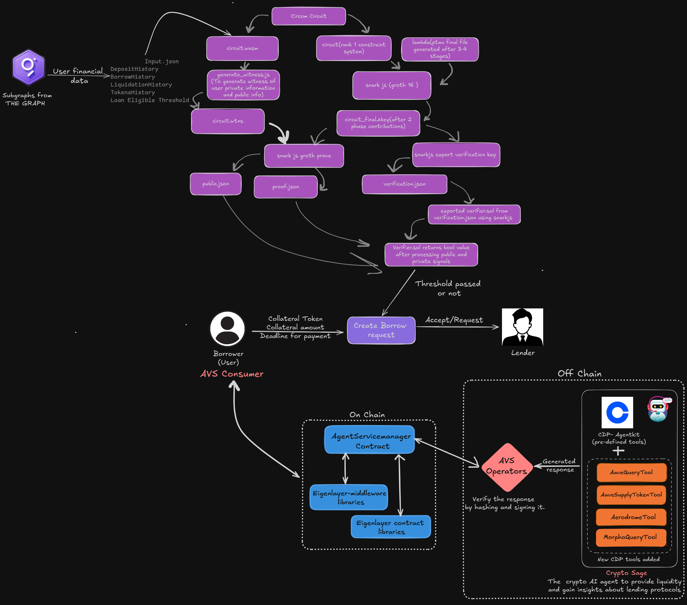
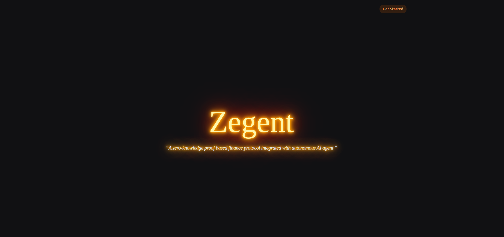
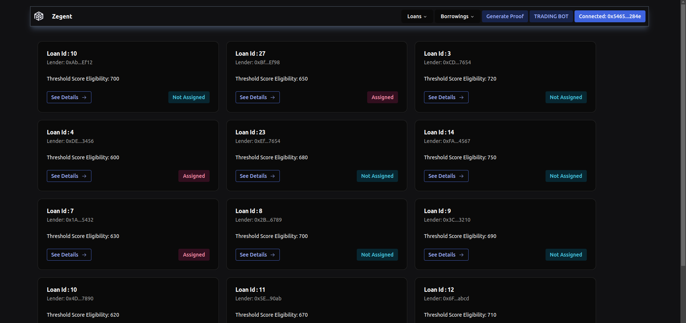
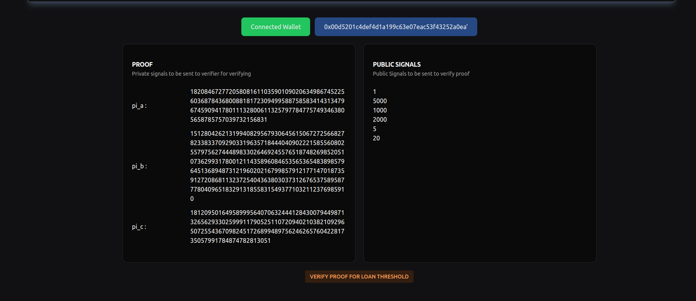
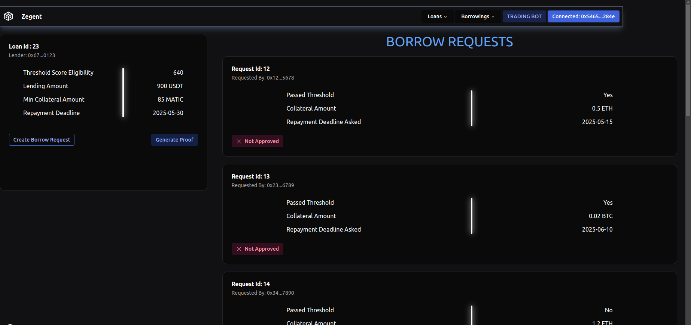
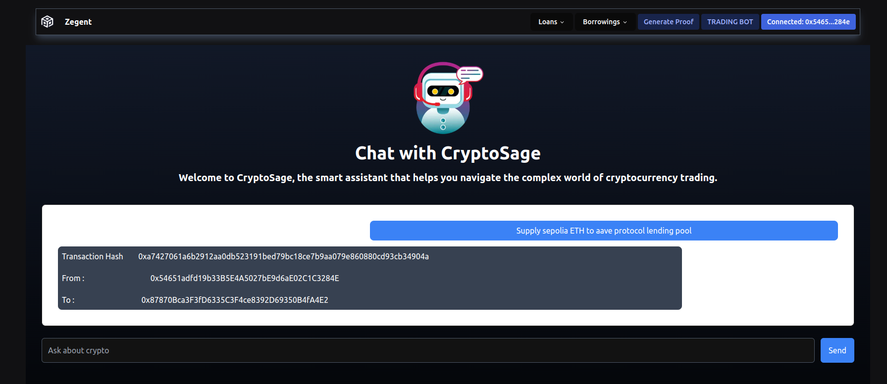

#  Zegent: Under-Collateralized Lending & Verifiable Crypto AI Agent

## 🚀 About

### **How Undercollateralized Lending Works**  
Zegent enables undercollateralized lending by assessing borrowers' financial history from various exchanges and protocols using the Arbitrum API for subgraphs deployed on GraphQL. The retrieved financial data is processed through the `generate_witness` algorithm in zk-SNARKs, generating private and public signals based on parameters set in the Circom circuit. Borrower history remains private, while loan threshold eligibility and other constants are public.

The public signals and zero-knowledge proof are then sent to the Loan Contract, which inherits the Verifier Contract to call the `verify` function. This function returns a boolean value indicating whether the borrower meets the loan eligibility criteria. Borrowers who pass verification can create loan requests, and lenders can view only those who qualify based on the threshold score. Borrowers with weaker financial scores, who do not qualify for loans, can leverage Zegent’s AI-powered exchange tools, utilizing exchange ABIs to strengthen their profile through analysis and informed trading.

---

### **CryptoSage – Verifiable AI for Trading & Analysis**
CryptoSage, built using the *CDP AgentKit*, enhances token trading and analysis through AI-driven tools such as `AaveQueryTool`, `AaveSupplyTokenTool`, `MorphoQueryTool`, and `AerodromeTool`. To ensure verifiability, CryptoSage is secured through *EigenLayer’s Autonomous Verifiable Service (AVS)* mechanism.

When an AVS consumer queries CryptoSage, the request is sent to the `AgentServiceManager` contract, which emits a `NewTaskCreated` event. This notifies registered Operators, who have staked and delegated assets, to process the request. Each Operator independently hashes the response, signs it using their private key, and submits the signed hash back to the `AgentServiceManager` AVS contract. Only registered Operators who meet the required stake threshold can submit responses, ensuring a secure, verifiable, and decentralized AI-powered system for lending decisions and crypto analysis.

---

##  Architecture

## 

## Glimpses Of Zegent

## 

## 

## 

## 

## 
